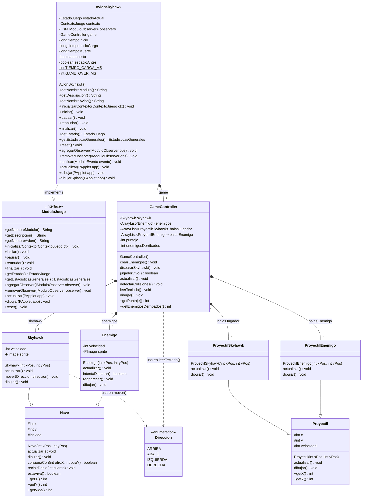

# Diagrama de clases — Módulo Skyhawk

Basado 100% en el código de los archivos `Skyhawk_*.pde`. Las clases del lobby
(`ModuloJuego`, `EstadoJuego`, etc.) se muestran solo como frontera/contrato,
porque `AvionSkyhawk` las usa pero no las define.

## Leyenda de visibilidad
- `+` público · `-` privado · `#` protegido · `$` estático
- **Atributos**: `private` (encapsulados) o `protected` cuando una subclase los
  hereda (`Nave` → `Skyhawk`/`Enemigo`, `Proyectil` → sus balas). El resto del
  juego los lee con **getters públicos** (`getX()`, `getPuntaje()`, ...).
- **(sin símbolo)** = acceso por defecto (de paquete): es lo que tienen los
  **métodos de comportamiento** (`actualizar()`, `dibujar()`, `mover()`, ...) porque
  en el código `.pde` no llevan modificador.
- `TIEMPO_CARGA_MS` (600) y `GAME_OVER_MS` (2500) son `static final` (constantes).

