# Diagrama de clases — Módulo Skyhawk 1942

> Basado 100% en el código de los archivos `Skyhawk_*.pde`.
> Las clases marcadas como **«lobby (externo)»** NO son parte del módulo: son
> contratos del lobby (`.java`) que el módulo referencia (las implementa o las usa).

## Leyenda de visibilidad
- `+` público · `-` privado · `#` protegido · `$` estático
- **Atributos**: `private` (encapsulados) o `protected` cuando una subclase los
  hereda (`Nave` → `Skyhawk`/`Enemigo`, `Proyectil` → sus balas). El resto del
  juego los lee con **getters públicos** (`getX()`, `getPuntaje()`, ...).
- **(sin símbolo)** = acceso por defecto (de paquete): es lo que tienen los
  **métodos de comportamiento** (`actualizar()`, `dibujar()`, `mover()`, ...) porque
  en el código `.pde` no llevan modificador.
- `TIEMPO_CARGA_MS` (600) y `GAME_OVER_MS` (2500) son `static final` (constantes).

```mermaid
classDiagram
    direction TB

    %% ===================== NÚCLEO DEL JUEGO (módulo Skyhawk) =====================

    class Direccion {
        <<enumeration>>
        ARRIBA
        ABAJO
        IZQUIERDA
        DERECHA
    }

    class Nave {
        #int x
        #int y
        #int vida
        Nave(int xPos, int yPos)
        actualizar() void
        dibujar() void
        colisionaCon(int otroX, int otroY) boolean
        recibirDanio(int cuanto) void
        estaViva() boolean
        +getX() int
        +getY() int
        +getVida() int
    }

    class Skyhawk {
        -int velocidad
        -PImage sprite
        Skyhawk(int xPos, int yPos)
        actualizar() void
        mover(Direccion direccion) void
        dibujar() void
    }

    class Enemigo {
        -int velocidad
        -PImage sprite
        Enemigo(int xPos, int yPos)
        actualizar() void
        intentaDisparar() boolean
        reaparecer() void
        dibujar() void
    }

    class Proyectil {
        #int x
        #int y
        #int velocidad
        Proyectil(int xPos, int yPos)
        actualizar() void
        dibujar() void
        +getX() int
        +getY() int
    }

    class ProyectilSkyhawk {
        ProyectilSkyhawk(int xPos, int yPos)
        actualizar() void
        dibujar() void
    }

    class ProyectilEnemigo {
        ProyectilEnemigo(int xPos, int yPos)
        actualizar() void
        dibujar() void
    }

    class GameController {
        -Skyhawk skyhawk
        -ArrayList~Enemigo~ enemigos
        -ArrayList~ProyectilSkyhawk~ balasJugador
        -ArrayList~ProyectilEnemigo~ balasEnemigo
        -int puntaje
        -int enemigosDerribados
        GameController()
        crearEnemigos() void
        dispararSkyhawk() void
        jugadorVivo() boolean
        actualizar() void
        detectarColisiones() void
        leerTeclado() void
        dibujar() void
        +getPuntaje() int
        +getEnemigosDerribados() int
    }

    %% ===================== ADAPTADOR / INTEGRACIÓN CON EL LOBBY =====================

    class AvionSkyhawk {
        -EstadoJuego estadoActual
        -ContextoJuego contexto
        -List~IModuloObserver~ observers
        -GameController game
        -long tiempoInicio
        -long tiempoInicioCarga
        -long tiempoMuerte
        -boolean muerto
        -boolean espacioAntes
        -int TIEMPO_CARGA_MS$
        -int GAME_OVER_MS$
        AvionSkyhawk()
        +getNombreModulo() String
        +getDescripcion() String
        +getNombreAvion() String
        +inicializarContexto(ContextoJuego ctx) void
        +iniciar() void
        +pausar() void
        +reanudar() void
        +finalizar() void
        +getEstado() EstadoJuego
        +getEstadisticasGenerales() EstadisticasGenerales
        +reset() void
        +agregarObserver(IModuloObserver obs) void
        +removerObserver(IModuloObserver obs) void
        -notificar(ModuloEvento evento) void
        +actualizar(PApplet app) void
        +dibujar(PApplet app) void
        -dibujarSplash(PApplet app) void
    }

    %% ===================== CONTRATOS DEL LOBBY (externos, referenciados) =====================

    class ModuloJuego {
        <<interface>>
    }
    class EstadoJuego {
        <<interface>>
    }
    class IModuloObserver {
        <<interface>>
    }
    class ContextoJuego {
        <<lobby>>
    }
    class ModuloEvento {
        <<lobby>>
    }
    class EstadisticasGenerales {
        <<lobby>>
    }
    class EstadoInvalidoException {
        <<exception>>
    }
    class NoIniciadoState {
        <<state>>
    }
    class IniciandoState {
        <<state>>
    }
    class EnEjecucionState {
        <<state>>
    }
    class PausadoState {
        <<state>>
    }
    class FinalizadoState {
        <<state>>
    }

    %% ---- Herencia ----
    Nave <|-- Skyhawk
    Nave <|-- Enemigo
    Proyectil <|-- ProyectilSkyhawk
    Proyectil <|-- ProyectilEnemigo

    %% ---- Composición (GameController crea y contiene) ----
    GameController "1" *-- "1" Skyhawk : skyhawk
    GameController "1" *-- "*" Enemigo : enemigos
    GameController "1" *-- "*" ProyectilSkyhawk : balasJugador
    GameController "1" *-- "*" ProyectilEnemigo : balasEnemigo
    AvionSkyhawk "1" *-- "1" GameController : game

    %% ---- Dependencias internas ----
    Skyhawk ..> Direccion : usa
    GameController ..> Direccion : usa

    %% ---- Integración con el lobby ----
    AvionSkyhawk ..|> ModuloJuego
    AvionSkyhawk --> EstadoJuego : estadoActual
    AvionSkyhawk o-- "*" IModuloObserver : observers
    AvionSkyhawk --> ContextoJuego : contexto
    AvionSkyhawk ..> ModuloEvento : crea
    AvionSkyhawk ..> EstadisticasGenerales : crea
    AvionSkyhawk ..> EstadoInvalidoException : throws
    AvionSkyhawk ..> NoIniciadoState : crea
    AvionSkyhawk ..> IniciandoState : crea
    AvionSkyhawk ..> EnEjecucionState : crea
    AvionSkyhawk ..> PausadoState : crea
    AvionSkyhawk ..> FinalizadoState : crea

    NoIniciadoState ..|> EstadoJuego
    IniciandoState ..|> EstadoJuego
    EnEjecucionState ..|> EstadoJuego
    PausadoState ..|> EstadoJuego
    FinalizadoState ..|> EstadoJuego
```

## Notas (todo derivado del código)
- **Herencia**: `Skyhawk` y `Enemigo` extienden `Nave`; `ProyectilSkyhawk` y
  `ProyectilEnemigo` extienden `Proyectil`. Las clases base traen métodos vacíos
  (`actualizar()`, `dibujar()`) que las hijas sobrescriben.
- **`GameController`** es el orquestador de la partida: contiene el `Skyhawk`, la
  lista de `Enemigo` y las dos listas de balas; lee el teclado, mueve todo y resuelve
  colisiones.
- **`AvionSkyhawk`** es el adaptador que implementa la interfaz `ModuloJuego` y delega
  la lógica en `GameController`. Usa patrón **State** (campo `estadoActual` de tipo
  `EstadoJuego`, crea las distintas `*State`) y **Observer** (lista `observers`,
  método `notificar(...)`).
- El sketch principal `Game1982.pde` (no es del módulo) es quien registra
  `AvionSkyhawk` en el `HomeJuego`.
