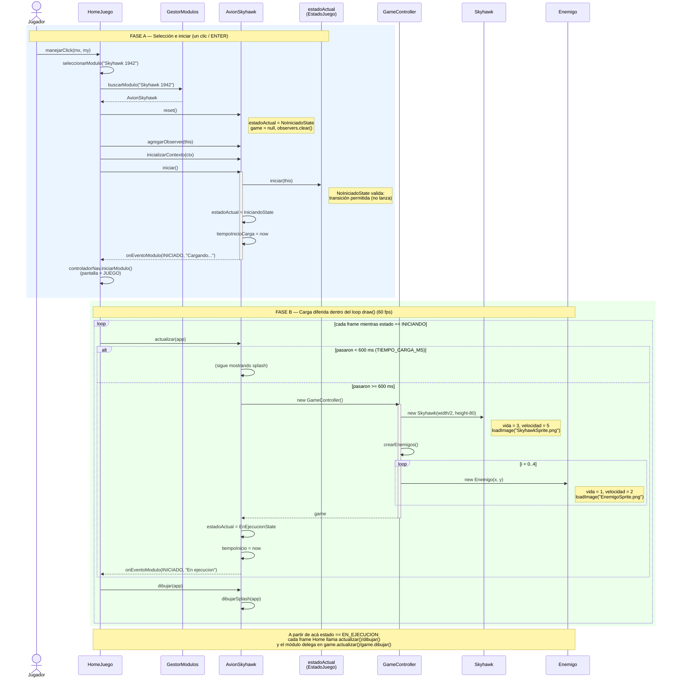
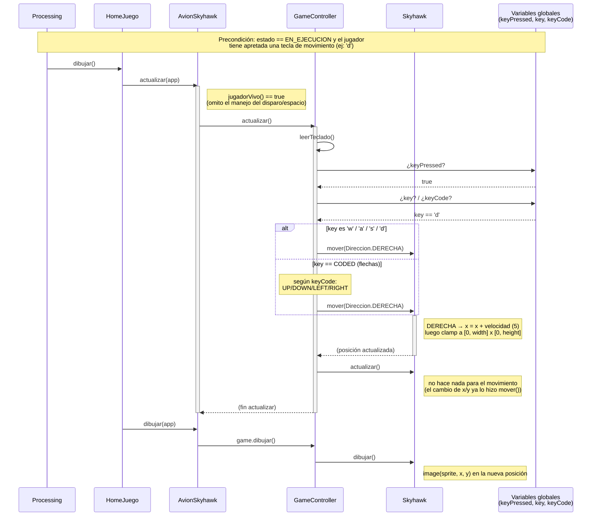
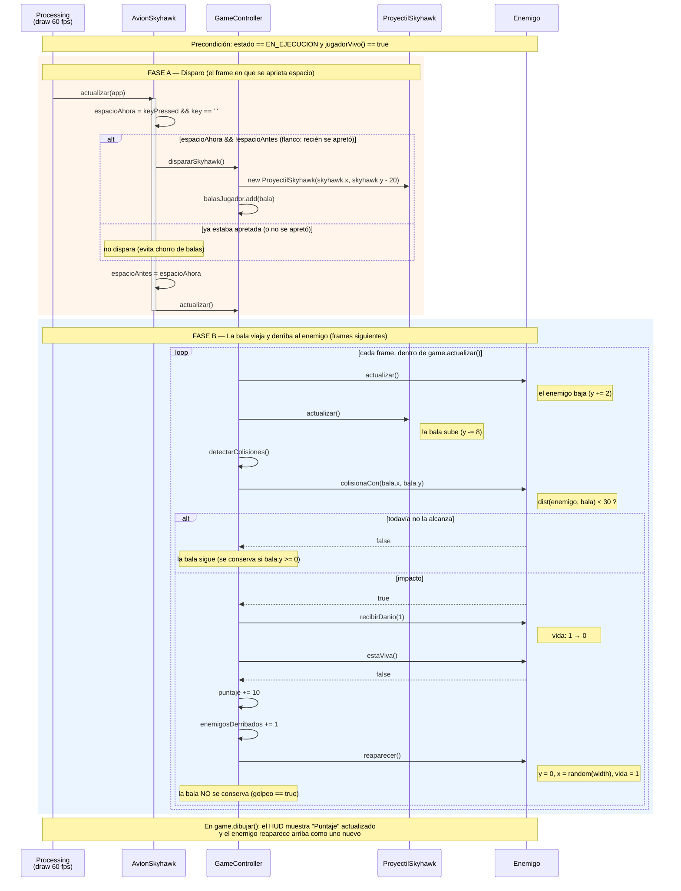
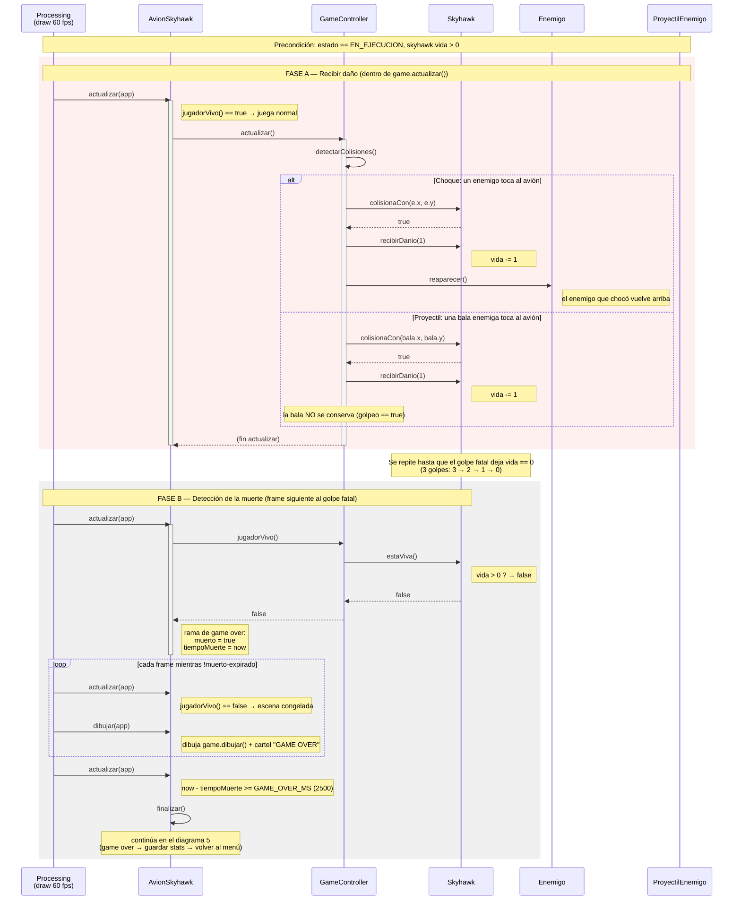
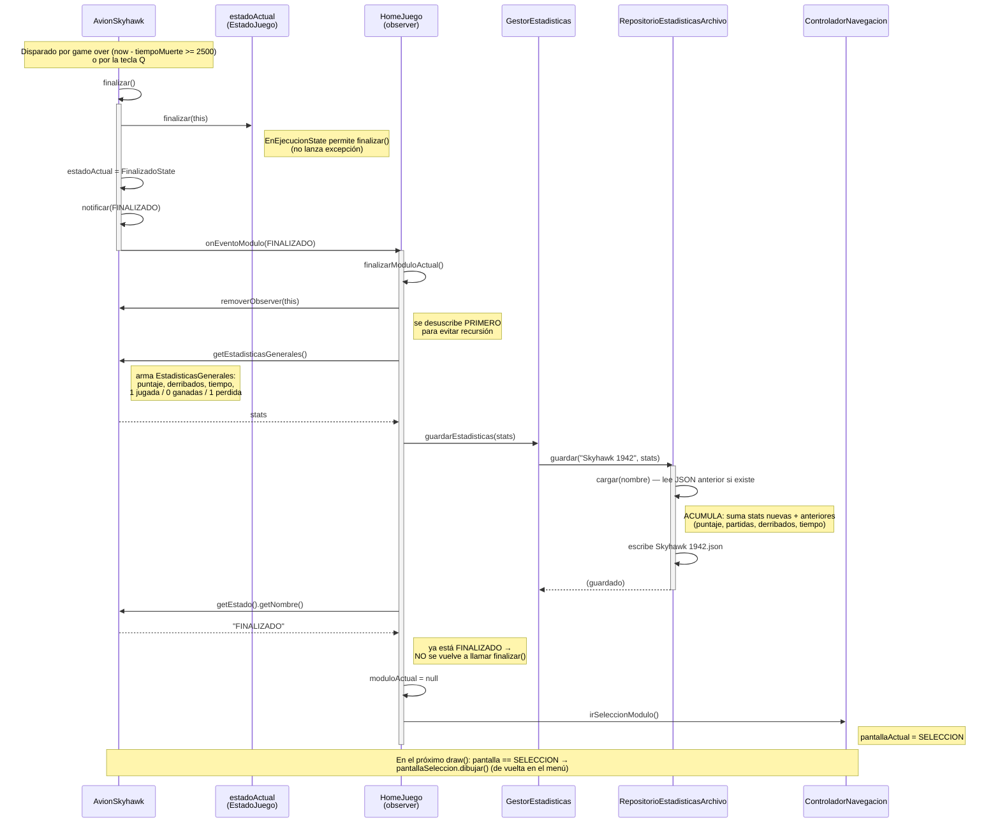
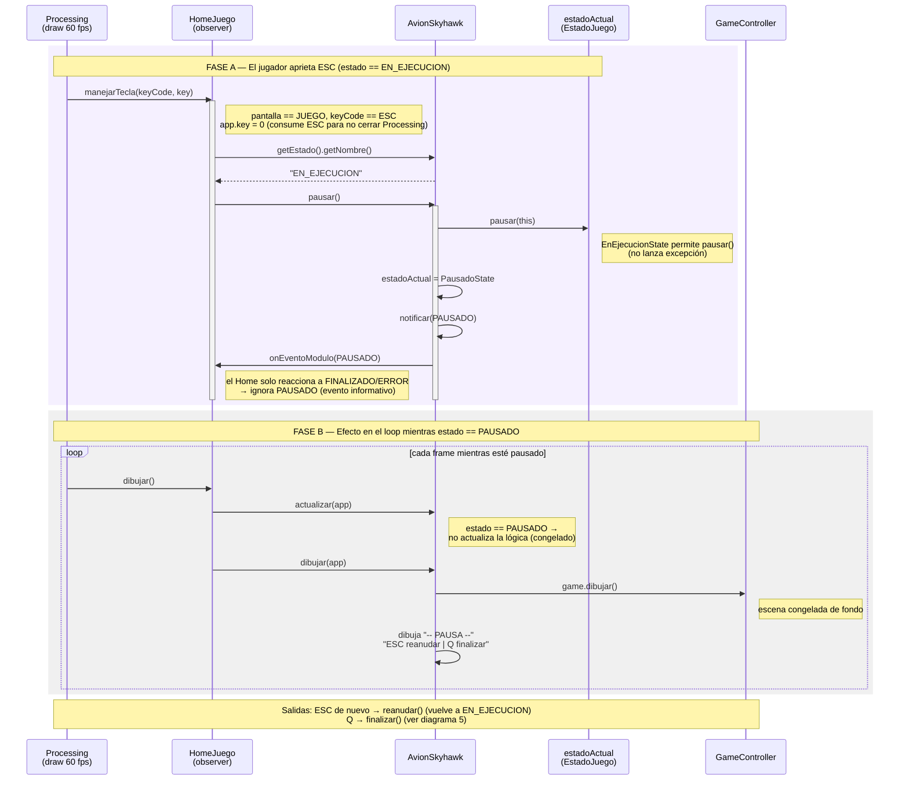

# Diagramas de secuencia — Módulo Skyhawk

Basados 100% en el código (`Game1982.pde`, `HomeJuego.java`, `Skyhawk_*.pde`).
Cada diagrama documenta un caso de uso del módulo.

---

## 1. Cargar la partida, el avión e iniciar el juego

Cubre desde que el jugador elige el módulo Skyhawk en el menú hasta que el juego
queda corriendo. El arranque tiene **dos fases**:

- **Fase A (un clic):** el Home prepara el módulo y dispara `iniciar()`. El módulo
  pasa a `INICIANDO` (splash de carga) pero **todavía no crea la partida**.
- **Fase B (en el loop de `draw`):** cuando pasan ~600 ms de splash, el módulo
  crea el `GameController` (la partida), que a su vez crea el avión y los enemigos,
  y recién ahí pasa a `EN_EJECUCION`.

### Notas de diseño

- **Carga perezosa (lazy):** la partida no se crea en `iniciar()` sino en el primer
  `actualizar()` que supera `TIEMPO_CARGA_MS`. Así el splash "CARGANDO..." se ve y la
  creación de sprites no congela el clic.
- **Patrón State:** `iniciar()` primero **valida** contra el estado actual
  (`NoIniciadoState.iniciar()` no lanza excepción) y recién después cambia de estado.
  Si el módulo ya estuviera en ejecución, el estado lanzaría `EstadoInvalidoException`.
- **Patrón Observer:** el módulo no conoce al Home; le **notifica** eventos
  (`INICIADO`) y el Home reacciona. El Home se registró como observer en la Fase A.
- **Dos eventos `INICIADO`:** uno al entrar en `INICIANDO` ("Cargando...") y otro al
  pasar a `EN_EJECUCION` ("En ejecucion").

---

## 2. Mover el avión (arriba, abajo, izquierda, derecha)

Cubre lo que pasa en **un cuadro** mientras el jugador tiene una tecla de movimiento
apretada (W/A/S/D o las flechas). Es un caso de uso que se repite 60 veces por
segundo mientras el estado sea `EN_EJECUCION`.

El detalle de diseño clave: el movimiento **no** llega por el evento `keyPressed` del
Home (`manejarTecla()`), sino que `GameController` **lee directamente** las variables
globales de Processing (`keyPressed`, `key`, `keyCode`) en cada cuadro. Esto se llama
*polling* (consultar el estado del teclado cada frame) y es lo que hace que, al
**mantener apretada** la tecla, el avión se mueva de forma continua.

### Notas de diseño

- **Polling, no eventos:** el movimiento se consulta cada frame dentro de
  `GameController.leerTeclado()`. Por eso *mantener* la tecla mueve continuamente. En
  cambio, ESC/Q sí pasan por el evento `manejarTecla()` del Home (pausar/finalizar) y
  el disparo se detecta por flanco en el módulo. Tres mecanismos distintos según la
  necesidad de cada acción.
- **WASD y flechas a la vez:** las letras viajan en `key`; las flechas son teclas
  "especiales" → Processing pone `key == CODED` y el código real en `keyCode`. Por eso
  hay dos bloques que terminan llamando al mismo `mover(Direccion.X)`.
- **El enum `Direccion`** desacopla "qué tecla se apretó" de "cómo se mueve":
  `leerTeclado()` traduce tecla → `Direccion`, y `Skyhawk.mover()` traduce
  `Direccion` → cambio de coordenadas. Cada uno tiene una sola responsabilidad.
- **Clamp a los bordes:** después de mover, `mover()` corrige `x`/`y` para que el avión
  no se salga de la pantalla (lo deja pegado al borde).
- **`Skyhawk.actualizar()` está vacío** a propósito: el movimiento ya lo aplicó
  `mover()`. Se mantiene por el contrato heredado de `Nave` (todas las naves se
  actualizan en el loop), aunque acá no tenga lógica propia.

---

## 3. Disparar y matar un enemigo

Cubre desde que el jugador aprieta la barra espaciadora hasta que una bala derriba a
un enemigo y suma puntaje. Es importante notar que **no pasa todo en un cuadro**: la
bala se crea en un frame y recién impacta varios frames después, cuando subió lo
suficiente para tocar al enemigo.

- **Fase A (un frame):** se detecta el disparo **por flanco** (la barra pasó de
  no-apretada a apretada) y se crea **una** bala en la punta del avión.
- **Fase B (varios frames):** cada frame la bala sube; cuando entra en rango de un
  enemigo, `detectarColisiones()` le baja la vida, lo derriba (vida llega a 0), suma
  puntaje y lo hace reaparecer arriba.

### Notas de diseño

- **Disparo por flanco:** `espacioAhora && !espacioAntes` dispara **una sola** bala por
  pulsación. Sin el `!espacioAntes`, mantener la barra apretada crearía una bala por
  frame (60 por segundo). Compará con el **movimiento**, que sí quiere repetirse al
  mantener la tecla — por eso usa polling puro sin detección de flanco.
- **Por qué espacio se lee distinto:** el Home no le pasa la barra espaciadora al
  módulo (solo intercepta ESC y Q), así que el módulo la lee directo de `app.keyPressed`
  / `app.key` y se guarda `espacioAntes` para comparar entre frames.
- **El `GameController` crea las balas**, no la nave. Igual criterio que con las balas
  enemigas: la nave decide *cuándo* (intención), el controlador maneja *la lista*.
- **"Matar" en realidad es reaparecer:** hay un pool fijo de 5 enemigos que nunca se
  achica. Al derribar uno, no se elimina de la lista: se le reinicia la vida y vuelve
  arriba en una columna al azar (`reaparecer()`). La "muerte" se refleja en el puntaje
  y el contador `enemigosDerribados`, no en el tamaño de la lista.
- **La bala se elimina al golpear:** cuando `golpeo == true`, la bala no se agrega a
  `balasQueSiguen`, así que desaparece. Las que no golpean se conservan mientras sigan
  dentro de la pantalla (`bala.y >= 0`).
- **`recibirDanio` + `estaViva`** vienen de la clase base `Nave`: el mismo mecanismo de
  vida sirve para el enemigo (vida 1, muere de un tiro) y para el avión (vida 3).

---

## 4. Morir (por colisión / choque de proyectil)

Cubre cómo el avión del jugador pierde vida y muere. Hay **dos fuentes de daño**, las
dos detectadas en `detectarColisiones()` y las dos terminan en `skyhawk.recibirDanio(1)`:

1. **Choque:** un enemigo toca al avión.
2. **Proyectil:** una bala enemiga toca al avión.

Como el avión arranca con **vida 3**, hacen falta **3 golpes** para morir. La muerte no
se "ejecuta" en el momento del golpe: el golpe solo baja la vida a 0. Recién en el
**frame siguiente**, el módulo pregunta `jugadorVivo()`, ve que es `false` y arranca la
secuencia de game over.

### Notas de diseño

- **Dos fuentes, un solo método de daño:** tanto el choque como la bala enemiga llaman
  a `skyhawk.recibirDanio(1)`. Centralizar el daño en `Nave.recibirDanio()` evita
  duplicar la lógica de vida.
- **La muerte es un estado, no un evento instantáneo:** `recibirDanio()` solo baja la
  vida. Nadie "mata" al avión en ese instante. La muerte se **detecta** después, cuando
  `jugadorVivo()` (→ `estaViva()` → `vida > 0`) da `false`. Esto desacopla *recibir el
  golpe* de *reaccionar a la muerte*.
- **Game over con demora (`GAME_OVER_MS` = 2500):** al morir no se vuelve al menú de
  golpe. El módulo marca `muerto`, congela la escena, muestra "GAME OVER" ~2.5 s y
  recién después llama `finalizar()`. Misma técnica de "mirar el reloj cada frame" que
  el splash de carga.
- **`muerto` se setea una sola vez:** el `if (!muerto)` arranca el cronómetro en el
  primer frame sin vida; los frames siguientes solo comparan el reloj. Sin esa guarda,
  `tiempoMuerte` se reiniciaría cada frame y nunca se cumpliría la espera.
- **El choque hace reaparecer al enemigo**, pero la bala enemiga simplemente se
  descarta (no se conserva en `balasEnemQueSiguen`): una vez que pegó, ya no existe.

---

## 5. Game over → guardar estadísticas → volver al menú

Continúa donde terminó el diagrama 4: el módulo llama a `finalizar()`. Acá se ve cómo
el módulo avisa al Home (patrón **Observer**), el Home **guarda las estadísticas**
(acumulándolas en disco) y vuelve a la pantalla de selección.

Este mismo flujo se dispara de **dos maneras**: automáticamente al morir (game over) o
manualmente cuando el jugador aprieta **Q**. Las dos terminan en `finalizar()`, así que
de acá en adelante el camino es idéntico.

### Notas de diseño

- **Observer desacopla módulo y Home:** el módulo no llama al Home directamente; solo
  emite el evento `FINALIZADO`. El Home, que está suscripto, reacciona. El módulo podría
  funcionar con cualquier observer (o con ninguno) sin cambiar una línea.
- **Desuscribirse primero (`removerObserver`):** evita recursión. Si el Home más abajo
  necesitara llamar `finalizar()` de nuevo, eso volvería a notificar y reentraría en
  `finalizarModuloActual()`. Al desuscribirse antes, ese segundo aviso no le llega.
- **Doble finalize evitado por el patrón State:** el módulo ya pasó a `FINALIZADO` antes
  de notificar, así que el Home consulta `getEstado()`, ve `"FINALIZADO"` y **no** vuelve
  a finalizar. El State sirve de guardia contra transiciones repetidas.
- **Persistencia acumulativa:** `Repo.guardar()` primero **lee** el JSON anterior del
  módulo (si existe), **suma** los valores y reescribe el archivo. Por eso las stats
  persisten y crecen entre partidas/sesiones. Como es un survival, cada partida aporta
  siempre `1 jugada / 0 ganadas / 1 perdida`.
- **Errores de guardado no rompen el juego:** `GestorEstadisticas.guardarEstadisticas()`
  atrapa `PersistenciaException` y solo lo loguea. Aunque falle el disco, el Home igual
  vuelve al menú.
- **Vuelve a SELECCION, no a INICIO:** terminada la partida, el jugador queda en la lista
  de módulos para elegir otro o ver estadísticas, no en la pantalla de título.
- **Dos disparadores, un solo camino:** game over automático y tecla Q llegan ambos a
  `finalizar()` → mismo `notificar(FINALIZADO)` → mismo `finalizarModuloActual()`.

---

## 6. Pausar

Cubre qué pasa cuando el jugador aprieta **ESC** durante la partida. La tecla ESC la
intercepta el **Home** (no el módulo) y funciona como *toggle*: si el juego está
corriendo, pausa; si ya está pausado, reanuda.

El efecto de la pausa se logra por el **cambio de estado** (`EN_EJECUCION → PAUSADO`),
no por el evento. A partir de ahí:

- `actualizar()` **no toca la lógica** del juego → la escena queda congelada.
- `dibujar()` sigue dibujando la escena congelada + el cartel "-- PAUSA --".

### Notas de diseño

- **ESC lo maneja el Home, no el módulo:** el contrato pide que los módulos NO manejen
  ESC ni Q; el Home los intercepta. Por eso el disparo (espacio) y el movimiento (WASD)
  los lee el módulo, pero pausar/reanudar/finalizar entran por `manejarTecla()`.
- **ESC es un toggle:** el Home consulta el estado actual. Si es `EN_EJECUCION` llama
  `pausar()`; si es `PAUSADO` llama `reanudar()`. Una sola tecla, dos comportamientos
  según el estado — apoyado en el patrón State.
- **`app.key = 0` consume el ESC:** en Processing, ESC cierra el sketch por defecto.
  Ponerlo en 0 "se come" la tecla para que no cierre la ventana.
- **La pausa la hace el estado, no el evento:** el cambio a `PausadoState` es lo que
  congela el juego (`actualizar()` corta la lógica). El evento `PAUSADO` se emite igual,
  pero el Home no hace nada con él — queda disponible por si otro observer lo necesita.
- **El Home sigue llamando `actualizar()` y `dibujar()` en PAUSADO:** su filtro en
  `dibujar()` incluye los tres estados activos (INICIANDO, EN_EJECUCION, PAUSADO). Por
  eso el módulo DEBE dibujar algo en PAUSADO; si no, la pantalla quedaría congelada sin
  aviso de que está en pausa.
- **State como guardia:** si por algún motivo se llamara `pausar()` fuera de
  `EN_EJECUCION`, el estado lanzaría `EstadoInvalidoException` (el Home la atrapa e
  ignora). El toggle ya evita ese caso, pero el estado protege igual.
- **Reanudar es el inverso simétrico:** ESC desde `PAUSADO` → `reanudar()` →
  `EnEjecucionState`, y `actualizar()` vuelve a correr la lógica del juego.
